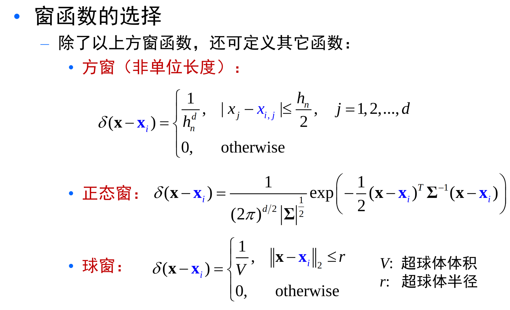
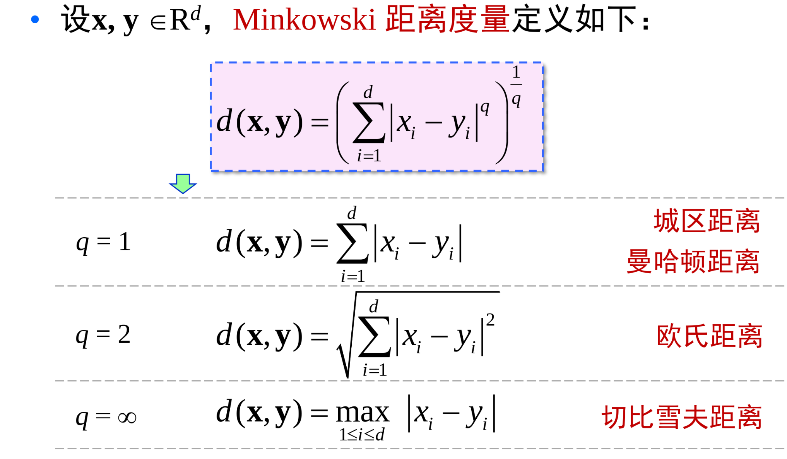

# 非参数估计

最大似然方法和贝叶斯估计均属于参数估计方法：待估计的概率密度函数的形式已知

但是很多情况下，我们对样本的分布没有充分的了解，无法事先给出概率密度函数的具体形式，
而且有些样本的分布也很难用简单的函数来描述。

非参数估计方法不需要对概率密度函数的形式作任何假设。

## 直方图方法

1. 将特征空间每个维度特征分为$l$ 个等间隔的小窗，每个小窗体积为 $V$。
2. 统计落入每个小舱的样本数目 $k_i$。
3. 将小舱内的概率密度视为常数，并用 $\frac{k_i}{nV}$ 作为其估计值。

$\frac{k}{n}$ 是对 概率P的一个很好的估计。另一个方面，假设p(X)连续，且小区域R的体积足够小，可以假定
在该小区域中p（x）是常数，于是可以估计 $p(X) = \frac{k}{nV}$。

应该保证随着样本数目的增加，小舱的体积应该尽可能小，同时又必须保证小舱内有充分多的样本，但每个小舱内的样本有是总数的很小一部分。

$\lim_{n \to \infty} V_n = 0; lim_{n \to \infty} k_n = \infty ; lim_{n \to \infty} \frac{k_n}{n} = 0$。

有两种方法

- Parzen window ：固定局部区域体积V，k变化。$V_n = \frac{1}{\sqrt{n}}$。可以看出当样本总数n固定时，这个区间大小就固定了。
- k-nearest neighbor ： 固定局部样本数k，V变化。$k = \sqrt{n}$。可以看出当样本总数n固定时，这个区件内的点数目确定了。

## Parzen 窗方法

假设小舱是一个超立方体，体积为 $V_n = (h_n)^{d}$。

定义一下d维单位方窗函数 $\varphi (u) = 1, when ｜u_j｜\le \frac{1}{2}, j = 1,2,...,d$

那么对于点 x，考察样本 $x_i$ 是否在以x为中心，$h_n$ 为棱长的立方体内，可以通过函数 $\varphi (\frac{x - x_i}{h_n})$

那么可以得到所有落入超立方体样本总数 $k_n = \sum_i \varphi (\frac{x - x_i}{h_n})$

从而有 $p_n(x) = \frac{k_n}{nV} = \frac{1}{n} \sum_i \frac{1}{V_n} \varphi (\frac{x - x_i}{h_n})$

于是定义 $\delta _n (x) =  \frac{1}{V_n} \varphi (\frac{x}{h_n})$

那么 $p_n(x) = \frac{1}{n} \sum_i \delta _n(x - x_i)$

要保证 $p_n(x)$ 是一个概率密度函数，那么需要保证 $\delta (x) > 0 , 积分为1$

通常 $\delta _n(x - x_i)$ 反映了样本 $x_i$ 对在x处概率密度估计贡献的大小，通常与 $x_i$ 到x 的距离有关。

概率密度就是将所有观测点在x点的贡献进行平均。

可以选择多种窗函数 

!!! note "Parzen算法特点"

    适用范围广，无论概率函数是规则的或者是不规则的、单峰的还是多峰的

    样本数趋于无穷时， $parzen$ 窗估计收敛于真实 $p(X)$

    该方法要求样本的数量要大。

    选择合适的窗口函数将有利于提高估计的精度和减小样本数量

    与直方图仅仅在每个固定小窗口内估计不同，用滑动的小窗口来估计每个点上的概率密度。

## k 邻接估计

在parzen窗估计中，小窗口体积视为样本总数函数。$v_n = \frac{v_1}{n}$

当$v_1$ 选择得太小，导致大部分是空的，会使得概率不稳定。当选的太大，概率会变得过于平坦，从而失去重要的空间变化。

所以选择k邻接，克服这些问题。

K邻接是采用大小可变舱的密度估计方法。

根据总样本数确定一个参数 $k_n$ ，要求每个小舱内拥有的样本数目是 $k_n$。

在估计$x$ 处的概率密度$p(X)$ 时，调整包含$x$的小舱的体积，直到小舱内恰好落入$k_n$个样本：$p_n(x) = \frac{k_n}{n V_n}$

同样，要保证 $lim_{n \to \infty} k_n = \infty ;lim_{n \to \infty} \frac{k_n}{n} = 0$

关键是如何计算 $V_n$ 。对于多维情况下，可以使用立方体包围盒：$p_n(X) = \frac{k_n}{2^d n \prod |x^i - x_{kNN}^i|}$

**注意这里分母是乘了一个2，说明是要对称，就是第k小距离然后对称也要包括**

!!! note "最近邻分类器"

    最近邻近样本，有理由相信它们的类别相同，或者类后验概率相同。

    决策规则 $g_i (x) = max -d(x,x_j)$。

    最近邻分类器的错误率是很接近贝叶斯分类器错误率。

    有结论，最近邻法的渐进错误率最坏不会超过两倍的贝叶斯错误率，而最好则有可能接近或达到贝叶斯错误率。

    一种改进就是引入投票机制，选择前k个距离测试样本最近的训练样本，来决定新样本的类别。找到在k近邻中出现类别最多的。

!!! note "距离度量"

    距离一般满足如下几个条件。非负性: $d(x,y) \ge 0$ ；自相似性:$d(x,x) =0$；对称性：$d(x,y) = d(y,x)$；三角不等式：$d(x,y) \le d(x,z) + d(z,y)$。

    距离可以描述点对间的相异程度。

    

    距离是对坐标变换敏感的。我们希望找到对给定变换具有不变性的距离度量。

    那么定义一个距离是在所有变换下的最小值，这样就找到了对变换具有不变性的值。

    距离度量学习，使得在特定任务中相似的样本在特征空间中更接近，不相似的样本则更远离。
