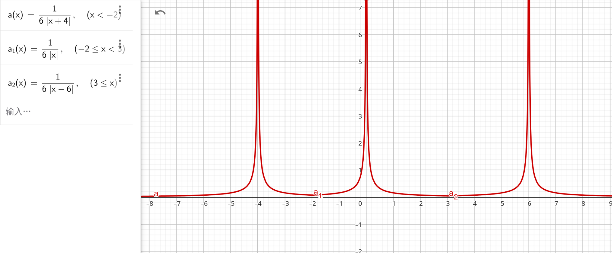
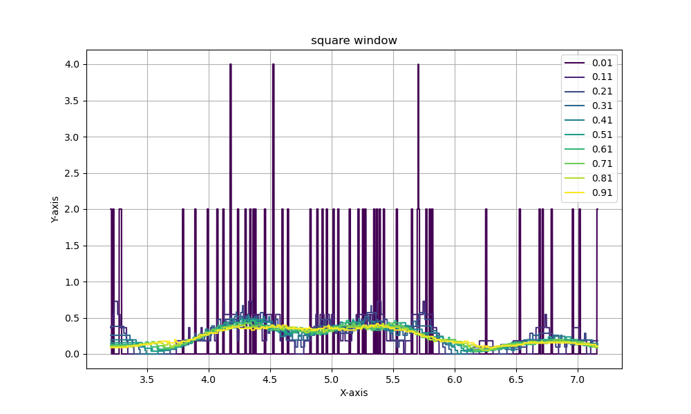

# 第二次作业

计算题和简答题

## 题目一

概率密度函数$p(x)$ 的 Parzen 窗估计为 $p_n(x) = \frac{1}{n} \sum_i \frac{1}{h_n} \varphi (\frac{x - x_i}{h_n}) = \frac{1}{n} \sum_i \frac{1}{\sqrt{2 \pi} h_n} exp({- \frac{(x - x_i)^2}{2 h_n^2}})$

## 题目二

一维空间中有点 $\{-4,0,6\}$，要找到最近邻估计。

先找到分割点 $-1,3$，然后根据公式 $p(x) = \frac{1}{2 * n |x - x_{1NN}|}$ 计算即可得：

$$
p(x) =
\left\{\begin{matrix} 
\frac{1}{6|x + 4|}, x < -2 \\
\frac{1}{6 |x|}, -2 \le x < 3 \\
\frac{1}{6|x - 6|}, 3 \le x \\
\end{matrix}\right .
$$




## 题目三

对于概率密度估计问题，简述EM算法的基本步骤：

1. E 步。对于样本隐变量 $z_i$，先基于当前的参数 $\theta^{old}$ 和其他的变量 $x_i$ 来估计 $z_i$。
进行估计隐变量的后验分布 $p(z_i | x_i , \theta^{old})$。

2. M 步。使用上一步估计的隐变量后验分布，来进行估计新的参数 $\theta^{new}$
即 $\theta^{new} = argmax_{\theta} \space Q(\theta , \theta^{old}) = argmax_{\theta} \sum_i \sum_{z_i} p(z_i | x_i, \theta^{old}) * ln (p(x_i,z_i | \theta))$

反复执行E步和M步，总过坐标轮替法最大化$\sum_i \sum_{z_i} p(z_i | x_i, \theta^{old}) * ln (p(x_i,z_i | \theta))$下界。

## 题目四

对于混合高斯模型参数估计问题，在EM优化框架下，其中 $Q(\theta,\theta^{old})$ 的基本形式。

首先明确，高斯模型参数估计下，隐变量为 $z_i$ 即每个数据点属于那个高斯成分。

那么需要先进行E步估计出隐变量的后验分布 $p(z_i | x_i ,\theta^{old}) = \frac{p(z_i,x_i| \theta^{old})}{p(x_i | \theta^{old})} = \frac{\pi_{z_i} \mathcal{N} (x_i,\mu_{z_i},\sum_{z_i})}{\sum_k \pi_{z_k} \mathcal{N} (x_k,\mu_{z_k},\sum_{z_k}) }$

这样即可根据旧的参数 $\pi,\mu,\sum$ 先估计出隐变量后验分布。

然后通过M步，根据E步估计的隐变量后验分布，估计新参数 $Q(\theta , \theta^{old})$

$$
Q(\theta,\theta^{old}) = \sum_i E( ln p( x_i,z_i |\theta))
= \sum_i \sum_{z_i} p(z_i | x_i, \theta^{old}) * ln p(x_i,z_i | \theta) \\
= \sum_i \sum_{z_i}  p(z_i | x_i, \theta^{old}) 
* ln (\mathcal{N}(x_i | \mu_{z_i} ,\sum_{z_i}) \pi_{z_i}) \\
= \sum_i \sum_{z_i}  p(z_i | x_i, \theta^{old}) 
* ln (\pi_{z_i})
+ \sum_i \sum_{z_i}  p(z_i | x_i, \theta^{old}) 
* ln (\mathcal{N}(x_i | \mu_{z_i} ,\sum_{z_i}))
$$

其中对 $\mu,\sum$ 求偏导后，结果转化为求解

$$
=argmax_{\pi} \sum_i \sum_{z_i}  p(z_i | x_i, \theta^{old}) 
* ln (\pi_{z_i}) \\
=  \sum_i \sum_{z_i} \frac{\pi_{z_i} \mathcal{N} (x_i,\mu_{z_i}^{old},\sum_{z_i}^{old})}{\sum_k \pi_{z_k}^{old} \mathcal{N} (x_k,\mu_{z_k}^{old},\sum_{z_k}^{old}) }
* ln (\pi_{z_i})
$$

并且要满足条件$\sum \pi_k = 1$。

这样即可估计出每个 $\mu,\sum,\pi$

其中估计值为 $\pi_k = \frac{1}{n} \sum_i p(z_i = k | x_i, \theta^{old})$，$\mu_k = \frac{\sum_i p(z_i = k | x_i, \theta^{old}) x_i}{\sum_i p(z_i = k | x_i, \theta^{old})}$，$\sum_k = \frac{\sum_i p(z_i = k | x_i, \theta^{old}) (x_i - \mu_k^{old}) (x_i - \mu_k^{old})^T }{\sum_i p(z_i = k | x_i, \theta^{old})}$

## 题目五

对于一阶HMM，描述其学习问题的基本任务。

1. 给定模型 $[A,B,\pi]$ ，有效地计算产生观测序列 $x = \{x_1,x_2,...,x_n\}$ 的概率 $p(x|A,B,\pi)$。
2. 给定模型和观测序列，如何找到于此观测序列相匹配的状态序列 $z = \{z_1,z_2,...,z_n\}$。
3. 给定观测序列 $x=\{x_1,x_2,..,x_n\}$，如何调整模型参数，使得该序列出现的概率 $p(x|A,B,\pi)$最大。

其中3是参数学习的问题。参数学习基本任务，通过拟合观测序列，确定HMM中的参数。

通过EM步骤，然后使用前向-后向算法进行解决该问题。

## 编程题一


编程实现方窗和高斯窗下的概率密度函数估计

下图为方窗下概率密度函数估计



下图为高斯窗下概率密度函数估计


相关代码如下

```
#include <algorithm>
#include <cmath>
#include <cstdio>

int n = 50;

double d;         // 方窗大小
double data[110]; // 所有样本点

double calc1(double idx) { // 计算方窗函数的概率
  double ans = 0;
  for (int i = 0; i < n; i++) {
    if (fabs(data[i] - idx) <= d / 2) {
      ans += 1.0 / d;
    }
  }
  return ans / n;
}

double calc2(double idx) { // 使用高斯窗进行计算
  double ans = 0;
  for (int i = 0; i < n; i++) {
    ans += exp(-(idx - data[i]) * (idx - data[i]) / (2 * d * d)) /
           (d * sqrt(2 * 3.14));
  }
  return ans / n;
}

int main() {

  for (int i = 0; i < n; i++) // 读取数据
    scanf("%lf %*c", &data[i]);

  double l = data[0];
  double r = data[0];
  double step = 0.001; // 步长

  for (int i = 0; i < n; i++)
    l = std::min(l, data[i]), r = std::max(r, data[i]);

  l -= step, r += step;

    // 上面找到数据中最大值和最小值

  char filename[100];
  for (double md = 0.01; md <= 1; md += 0.1) { // 枚举不同的窗宽度
    FILE *file;

    sprintf(filename, "%.2lf.csv", md);

    // 打开文件以写入（"w"模式会创建文件或覆盖已存在的文件）
    file = fopen(filename, "w");

    d = md;
    for (double idx = l; idx < r; idx += step) {
      fprintf(file, "%lf,%lf\n", idx, calc2(idx));
    }

    fclose(file);
  }

  return 0;
}
```


