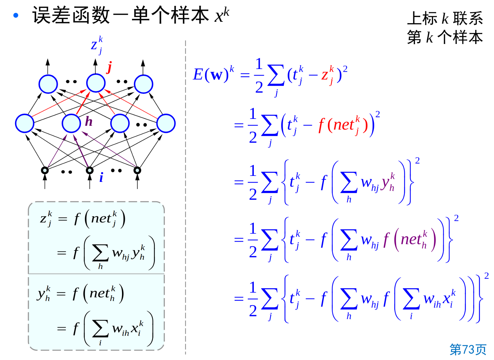

# 人工神经网络

## 发展历程

模仿大脑的学习过程，神经元按照外部的激励信号做自适应变化。

人工神经网络是一种模仿生物神经网络的结构和功能的数学模型或计算模型。

1943,建立了神经网络数学模型，MP Machine Perception模型。

1949,书中提出了突触联系强度可变的设想。

第一次高潮，1962年 The Principles of Neurodynamics

第二次高潮，1982年 John Hopfield 提交神经网络报告，提出Hopfield网络。

## 人工神经网络基础

神经细胞由细胞体和突起组成。短的叫树突，长的叫轴突。

树突有大量分枝，长度短，用于接受来自其它神经元的信号。

轴突用以输出信号，较长。突触是一个神经元与另一个神经元相联系的特殊部位。

进入突触的信号会被加权，一个神经元有两种状态，兴奋和抑制。

如果叠加总量超过某个阈值，神经元就会被激发进兴奋状态，发出输出脉冲。

人工神经元与生物神经元一样:

处理单元有很多输入信号，同时叠加到处理单元上。

处理单元的每一个输入都经过相关的加权。

!!! note "激活函数"

    也称激励函数，转移函数，传输函数或限幅函数。作用是将可能的无限域变换到指定的有限范围内进行输出，并引入非线性性。

    Sigmoid函数软饱和，是阻碍神经网络发展的重要原因。

    新型激活函数ReLU在一定程度上克服了梯度消失，使得深度网络的直接监督式训练成为可能。

拓扑结构

单层网络：
- 输入信号为一个向量，每个分量通加权连接到各个结点
- 每一个结点均可产生一个加权和
- 输入和结点间采用全连接，并且都是前馈连接。

多层网络由单层网络进行级联构成，即上一层的输出作为下一层的输入。

接收输入信号的层称为输入层，产生输出信号的层称为输出层，中间层又称为隐含层，不直接与外部环境打交道。
层与层之间可以全连接，也可以部分连接。

**激活函数应该是非线性，否则多层网络表示能力不比单层网络强。**

!!! note "反馈网络"

    结点的输出：依赖于当前的输入，也依赖于自己以前的输出。

    网络有回路，信息可以沿回路流动。

    前馈型网络“不存储短期记忆”，结点的输出仅仅是当前输入的加权和（再激励）。

    反馈网络类似于人类短期记忆。

网络训练：加入训练样本，按照预定规则调整网络各权重。

有监督的训练：对于每个训练数据，通过该网络计算后尽可能输出其给定的目标值。
无监督训练：不要求有目标向量，网络通过自身“经历”来学会某种功能。使其输出具有某种可理解的规律性。
从本质上讲，训练过程是抽取样本所隐含的统计特征。

!!! note "Hebb训练方法"

    基本思路：如果两个相互联接处理单元处于相同激励电平，则突触传导增强。

    训练策略：数学上，两节点i和j的连接权重按他们的输出值之积来改变。$W_{ij}^{t+1} = W_{ij}^t + \eta y_i z_j$
    规则是：前馈、无指导学习规则。

!!! note "$\delta$ 训练方法"

    按照差值 $\delta$ 最小准则连续修正各连接权重强度。

    差值指处理单元所要求的输出与当前实际输出间的差值。

    训练策略：梯度下降法。$\Delta w_{ij} = - \eta \frac{\partial E}{\partial W_{ij}}$（其中$E$为与训练样本相关的损失函数或能量函数）

!!! note "随机训练方法"

    采样概率和能量关系来调节权重。

    随机改变一个权重，计算改变后产生的最终能量，依据下面准则确定是否接受改变：

    改变后能量降低则接受，若改变后能量没有降低则依据一个概率分布来接受改变。

    如：模拟退火

!!! note "Kohnen训练方法"

    结点参与彼此竞争，最大输出结点为获胜者。

    获胜者抑制其竞争者的能力和激活近邻结点的能力，只有获胜者和其邻接结点允许被调节。

    获胜者的邻接结点的范围在训练中是可变的。

    自组织竞争型网络。是无监督训练方法。

## 单层前馈神经网络（单层感知器）

有输入向量:$x=[1,x_1,....,x_d]^T$

有输出向量:$z=[z_1,....,z_c]^T$

权重集合$W={w_{ij}}$

对于输出层结点j，输入加权和为 $net_j = \sum_i W_{ij} x_i = W_j^T x$，称为净输入。

$Z_j = f(net_j) = f(\sum_i w_{ij} x_i)$

使用上面介绍的$\delta$规则，非线性激励单元

$E(w) = \frac{1}{2} \sum (t_j^k - z_j^k)^2 = \frac{1}{2} \sum (t_j^k - f(net_j^k) )^2$

则$\Delta w_{ij} = - \eta \frac{\partial E}{\partial w_{ij}} = \eta \sum_k (t_j^k - z_j^k) f^{'}(net_j^k) x_i^k$

可以单样本随机更新，也可以批量更新，所有样本完成后再更新。

## 多层前馈神经网络（多层感知器）

其实就是对上面的扩展，多了一个隐含层，记作y结点。

网络在进行计算的时候，层内是并行的，层间是串行的。

学习的任务是确定联接权重:$w_{ih},w_{hj}$

**误差反向传播BP算法**

BP算法核心是梯度下降。原理是利用输出后的误差来估计输出层的前一层误差，再用这个误差估计更前一层的误差，一层一层反传下去，从而获得其各层误差估计。

BP是一种高效计算神经网络权重梯度的算法。

那么对于隐含层到输出层：

$\Delta w_{hj} = \eta \sum_k (t_j^k - z_j^k) f^{'} (net_j^k) y_h^k = \eta \sum_k \delta_j^k y_h^k$

其中$\delta_j^k = -\frac{\partial E}{\partial net_j^k} = f^{'} (net_j^k)(t_j^k - z_j^k) = f^{'} (net_j^k) \Delta_j^k$

对于输入层到隐含层

$\Delta w_ih  = \eta \delta_h^k x_i^k$，其中$\delta_h^k = - \frac{\partial E}{\partial net_h^k}$

$\delta_h^k = f^{'}(net_h^k) \sum_j w_{hj} \delta _j^k$

这里就是误差反传，输出的误差反向传播影响前面结点的权重。

同样也有随机更新算法和批量更新算法。

## 准则函数

- 平方误差准则：$E_{MSE}(w) = \sum (t_j^k - z_j^k)^2$
- 交叉熵准则：$E_{CE}(w) = - \sum t_j^k ln(z_j^k)$，这里$z_j^k$ 为预测$x^k$ 属于第k类的后验概率。$z_j = \frac{exp(y_j)}{\sum_i exp(y_i)}$
- Minkoshki误差准则：$E_{Mink}(w) = \sum |t_j^k - z_j^k|^R$

!!! note "激活函数"

    激活函数应该是非线性的。是连续可导的。

    激活函数最好是单调的，否则误差函数会包含更多的局部极小值点，从而增加训练难度。

    现在用的最多的是ReLU函数及其变种

!!! note "隐含层数"

    Heche-Nielsen证明，当各结点具有不同阈值，具有一个隐含层的网络可以表示任意函数。(理论指导)

    对于分类问题，隐含层的个数决定了网络的表达能力，决定决策面的复杂程度。

    实践中仍采用多层网络

隐含层结点数，通常隐含层结点个数设置得比较大。

初始权重方法：随机初始化、预训练初始化

!!! note "正则化技术"

    目标函数正则化

    $E_{new}(w) = E(w) + \frac{\varepsilon}{2 \eta} w^T w$

    那么权值更新过程：

    $w_{ij} = w_{ij} - \eta \frac{\partial E_{new}(w)}{\partial w_{ij}} = w_{ij} - \eta (\frac{\partial E(w)}{\partial w_{ij}} + \frac{\varepsilon}{\eta} w_{ij}) = (1 - \varepsilon)w_{ij} - \eta \frac{\partial E(w)}{\partial w_{ij}}$

    这里就会导致上一次的权值减少，出现权值衰减现象。

学习率：学习率$\eta$ 太小收敛较慢，过大则不稳定。应该检查权重误差是否确实降低了误差，如果是则$\eta$ 减小，如果连续几次均增加则可能$\eta$太保守，应该增加一个量。

梯度下降发改进：附加冲量项。在最优点附近，误差平面可能比较平坦，梯度下降法收敛慢，可以考虑更多历史信息

$m_t = \beta m_{t-1} + (1 - \beta)g_t$,$g_t = \frac{\partial E(w)}{\partial w}$，并且$w_{t+1} = w_t - \eta m_t$

采用动量技术迭代后轨迹会更平滑，并加快收敛。

还有改进，引入二阶动量，$v_t$

训练停止准则：训练停止没有固定准则，overfittingf 训练样本的分类正确率很高，但对新样本分类能力不高。

BP训练算法存在：
完全难以训练：

- 网络麻痹现象:$\delta$正比与$f^{'}(net)$，导致$f^{'}(net) -> 0$，$\delta -> 0$，相当于调节过程几乎停顿下来。
- 梯度消失：多层网络，在传播的时候 $f^{'}(net)$ 是小于1，导致多层会导致逐步衰减。
- 局部最小和鞍点：损失函数由于高度非线性，可能存在很多凹凸不平的点。所以可能会陷入局部最小点。解决：在网络训练中引入随机性，使用随机梯度下降。

训练时间过长：对复杂问题需要很长时间训练，可能选取了不恰当的训练速率

ICS：Internal Covariate Shift

每层参数更新会导致上层输入数据发生分布剧烈变换。需要高层重新适应参数更新。所以使用Batch Normalization，将数据的每维特征调整至均值为0，方差为1.

一般在输入非线性激活函数前对数据进行BN操作。

!!! note "径向基函数网络"

    Radial Basis Funcstion nerworks

    是一种三层的神经网络，使用径向基函数作为隐层计算单元。

    RBF网络也可以对任意连续的非线性函数进行近似。

    $z_j = \sum_h w_{hj} \phi_h(x)$

    其中$\phi_h(x)$为径向基函数，$\phi_h(x) = exp(-\frac{||x - m_h||^2}{2\sigma^2})$

    $m_h$就是径向基函数的中心，这个函数其实表示x与中心相似度。

    径向基函数通常使用高斯函数，也可以采用其它函数。

    网络为三层神经网络，隐含层激活函数为高斯函数。从输入层到隐含层，从原先的线性加权转到 $net_h = \sum_i (x_i - w_{ih})^2$，那么$y_h = exp(-\frac{net_h}{2 \sigma^2})$，则$z_j = \sum_h w_{hj} \phi_h(x)$

    两步训练方法：径向基函数个数、中心（小规模采用全部样本，大规模采样，聚类）。端到端：使用BP算法学习径向基函数中心、窗宽、隐层到输出层的权重。

    将聚类中心作为径向基函数的中心，这样简化了网络规模，提高计算效率。

## 反馈神经网络

通过网络神经元状态变迁，最终稳定于某一状态，得到联想存储或神经计算的结果。反馈网络一般具有一般非线性系统的许多性质，如稳定性、各种类型的吸引子以及混沌现象。

### Hopfield网络

Hopfield网络是一种单层、全连接的反馈网络。

它的目的是从残缺或噪声数据中还原完整数据。

输入是d个$\{-1,+1\}$，输出也是d个分量。在t时刻也是d个分量。

Hopfield网络是对称、无自环的。$w_{ij} = w_{ji},w_{ii} = 0$。网络所有d个结点之间连接权用矩阵w来表示。

网络运行方式：信息在网络中循环往复传递。$v(t+1) = sgn(W v(t))$

参数估计：将完整数据存储进网络。

例如是存储K个完整数据，可以使用外积法 $W = \sum_k x^k(x^k)^T - KI$。

### 玻尔兹曼机

Boltzman Machine,BM

是一种随机的Hopfield网络，是具有隐单元的反馈互联网络。

BM中一部分神经元与外部相连，可以起到网络的输入、输出功能，或者严格地说可以受到外部条件的约束。

Restrictd BM，简化了的玻尔兹曼机。具有两层，层间相连，层内结点不相连，信息可双向流动。包含可视结点层和隐含层。

### 自组织映射

自组织竞争神经网络类型（self-Organizaing Map,SOM）

自组织映射，神经网络中邻近的各个神经元通过侧向交互作用彼此竞争，自适应地发展成检测不同信号的特殊检测器。

1. 相似的输入所激活的神经元位置上是相近的。(连续映像、拓扑保持)
2. 一个神经元兴奋后，会对其邻近的神经元产生刺激作用，对距其较远的神经元产生抑制作用。（竞争学习）

两层结构，第一层是输入层，第二层是输出层（竞争层)。

竞争层之间连线代表近邻间的相互作用，但没有信息传递。

SOM网络的前向推理：
Kohonen 自组织特征映射算法，能够自动找出输入样本之间的相似度，将相似的输入在网络上就近配置。
欧式距离：$d_j = \sqrt{\sum_i (x_i - w_{ij})^2}$，网络输出：当前输入获胜单元是1，否则是0.

竞争学习规则：网络的输出神经元之间相互竞争并期望被激活。对每个输入样本x，只有一个输出神经元被激活。被激活神经元称为获胜神经元，获胜神经元对其它神经元的影响是由近及远的，由兴奋逐渐转变为抑制。

## 深度学习浪潮

挑战：网络结构单一、参数过多、可实现的任务单一、训练样本相对较少、计算能力十分有限、学习方法不足够高效。

具有多个隐层的人工神经网络，具有优异的特征学习能力，学习得到的特征对数据有更本质的刻画。

深度神经网络在训练上的难度，可以通过“逐层初始化”来有效克服。

深度学习为什么有效？

浅层神经网络可以近似任意函数，为何多层？

深层网络结构中，特别是卷积神经网络中，高层可以综合应用低层信息。

低层关注“局部”，高层关注“全局”、更具有语义化信息。

为自适应地学习非线性处理过程提供了一种可能的简洁、普适的结构模型。

特征提取与分类器可以一起学习。
