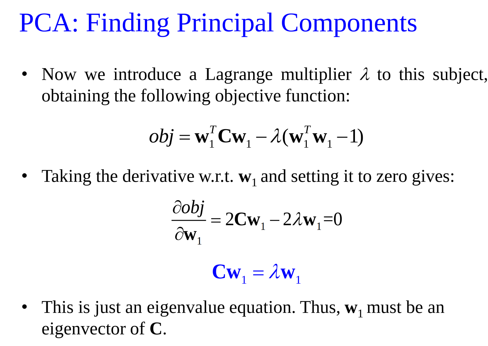

# 特征提取与特征变换

## 引言

特征提取的目的：提取观测数据的内在特性，减少噪声影响，提高稳定性。

特征变换的目的：

- 降低特征空间的维度，增加数据密度、降低过拟合风险
- 便于分析和减少后续步骤的计算量
- 减少特征之间可能存在的相关性
- 有利于分类

## 特征提取

### 语音特征提取

MFCCS

### 文本特征提取

向量空间模型: Vector Space Model 忽略词对顺序，将文档看做词的集合。词袋模型、TF-IDF模型

词向量：Word2Vec

词袋模型：BOW，一个维度对应词典一个词项，出现则非0，否则为0.字典包含所有可能的词项，文档特征向量长度等于字典长度。

!!! note "TF-IDF 词频-逆向文档频率"

    $IDF(t,D) = log \frac{1}{DF(t,D)}$

    $TF-IDF(t,d,D) = TF(t,d) \times IDF(t,D)$

Word2Vec：利用一个连续向量来表述一个词项

主要目的：相似单词具有相似的向量表示

### 视觉特征提取

LBP 局部二值模式

看这个位置周围一圈，比中间元素大还是小，大就取1，小就取0。然后按二进制记录即可。

$LBP(x) = \sum sign(I(x_i) - I(x)) 2^i$

## 特征变换

线性变换： $y = W^T x$

非线性变换： $y = w(x)$

最终形式都是使用向量来表示数据样本，便于分析。

!!! note "维数灾难"

    当空间维度增加时，分析和组织数据会遇到各种问题

    当维度增加时，空间的体积增加得很快，可用数据变得稀疏。

    随着维数的增加，具有相同距离的两个样本相似度可以相差很于远。

维数缩减：降维。通过某种数学变换将原始高维特征空间变换至某个低维"子空间"。

很多时候，人们收集到的数据虽然是高维的，但与学习任务密切相关的特征通常位于某个低维分布上。

### 线性降维法

$y = W^T x, x \in R^m,y \in R^d ,d < m$

变换矩阵W可以视作 $m$ 维度空间中 d 个基向量组成的矩阵。

$y = W^T x$ 可以视为样本x与d个基向量分别做内积得到，即x在新坐标系下的坐标。新空间的特征是原空间特征线性组合。

### 主成分分析

Principal Component Analysis PCA

由于沿着方差最大的方向进行投影，将更多地保留原始数据集的信息。

方差较大的方向称为主成分。

然后引入lagrangian 约束

!!! note "PCA 算法"

    计算所有数据均值 $\frac{1}{n} \sum x_i$

    计算数据协方差矩阵： $C = \frac{1}{n} \sum_i (x_i - \bar{x})(x_i - \bar{x})^T$

    对矩阵C进行特征值分解，取最大的m个特征值对应的特征向量，组成投影矩阵。

    将每一个数据进行投影：$y_i = W^T x_i$

进一步分析：可区分性要求方差最大化，可重构性要求重构误差最小化

### 线性判别分析

LDA ：对于两类分类问题，设法将样本投影到一条直线上，使得同类样本的投影点尽可能接近，不同类样本的投影点尽可能相互远离。

LDA线性判别分析：设法将样本投影到一条直线上，使得同类样本的投影点尽可能接近，不同类样本的投影点尽可能相互远离。

让同类样本投影点的方差尽可能小，即 $w^T \sum_0 w + w^T \sum_1 w$ 尽可能小。让类中心点之间的距离尽可能大，即 $(w^t \mu_0 - w^T \mu_1)^2$ 仅可能大。

全局散度矩阵：$S_t = \sum_i (x_i - \mu)(x_i - \mu)^T，\mu = \frac{1}{n} \sum_i x_i$

类内散度矩阵：$S_w = \sum_j S_{wj}, S_{wj} = \sum_{x \in X_j} (x-\mu_j)(x - \mu_j)^T$

类间散度矩阵：$S_b = S_t - S_w = \sum_j n_j (\mu_j - \mu)(\mu_j - \mu)^T$，$n_j$ 为属于第j类的样本个数。

通过求解 $S_b w = \lambda S_w W$ 广义特征值问题得到。

