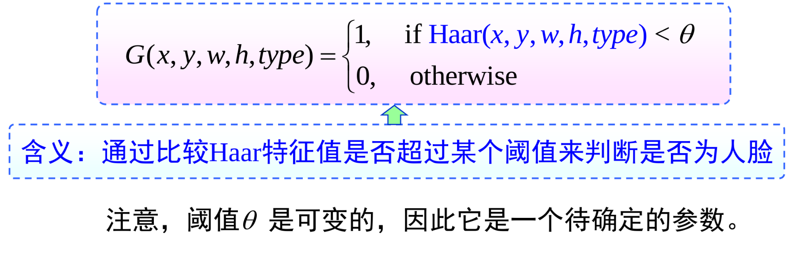
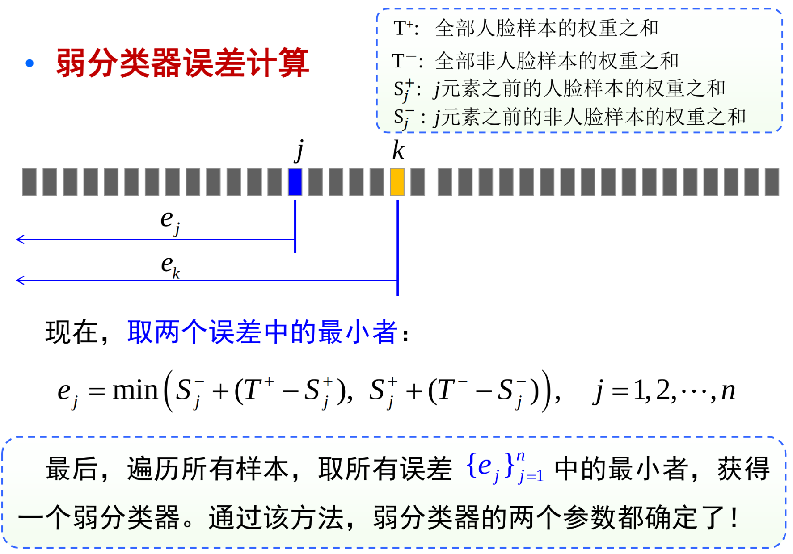

# 模型选择与集成学习

机器学习方法，任务：从已知数据中学习决策函数、规则、知识，用于对新数据的预测和分析。

学习方法=模型+评价+优化

为学习方法选择一种模型，就意味着选择一个特定的函数集合。所学到的模型只能在假设空间中。

优化：一个搜索算法，在假设空间$\mathcal{F}$ 中找到使得评价函数得分最高的模型。

模型的误差：对给定训练数据集T，假设学习得到的模型 $f(x)$

训练/经验误差： $R_{emp}(f) = \frac{1}{n}\sum L(y_i, f(x_i))$

测试/泛化/期望误差： $R_{exp}(f) = E_{(X,Y) ~ p(x,y)} L(y, f(x))$

对于一个学习方法，训练数据越多，得到的模型泛化性能越好。训练样本增加时，训练误差与测试误差间的gap会减小。

但是训练误差不是泛化误差的一种很好的估计。Occam 剃刀原理，应该选用比必要更加复杂的模型。$\min_{f \in \mathcal{F}} \frac{1}{n} \sum L(y_i,f(x_i)) + \lambda J(f)$，其中 $J(f)$ 为泛函，模型f 越复杂就越大。

没有免费的午餐定理：对于整个函数集而言，不存在万能的最佳算法。在无假设前提下，没有理由偏爱某一学习算法而轻视另一个。

## 模型评价与模型选择

样本的划分：

保持方法：一部分用于训练，一部分用于测试 holdout

自助法：有放回地随机抽取n个样本 Bootstrap

!!! note "交叉验证：Cross-validation"

    - 将数据平分为k个子集，用 $k-1$ 个子集进行训练，余下的部分用于验证，并计算验证误差。重复k次，得到k次结果的平均。

    - 刀切法：每次从样本集中，删除一个或者多个样本，用剩余的样本作为“刀切样本”进行训练。

    - 交叉验证是目前最常用的一种模型选择和评估方法。(特别是对模型的参数进行选择)

## 分类器集成

目标：将若干单个分类器集成起来，共同完成最终的分类任务，期望取得比单个分类器更好的性能。

统计上，要搜索的假设空间十分巨大，但是训练样本的个数却不足够用于精确地学习到目标假设。

策略：将多个假设集成起来能够降低这种风险。

计算上：分类器训练模型通常面临高计算复杂度。多假设的集成可使最终结果更接近实际的目标函数值，降低风险。

每个单一的学习器错误率都应当低于0.5，否则集成的结果反而会提高错误率。进行集成学习的每个分类器还应当各不相同。

!!! note "集成学习的常用技术手段"

    - 处理训练数据：对训练样本进行随机分组，对错分样本进行加权

    - 通过处理特征：每一次只选择一部分特征来训练分类器

    - 通过处理类别标号：对多类问题，一对一策略、一对多策略

    - 通过改进学习方法：变更学习参数、模型结构等

集成算法按基本分类器类型是否相同：异态集成（基分类器类型不同），同态集成（基分类器类型相同）。

按照训练数据处理方法分类：Bagging、random subspace、boosting、adaboost、随机森林

!!! note "层叠泛化"

    采用多层结构，第一层学习器配置不同的学习算法。第一层的输出作为第二层的输入，第二层学习层称为“元学习器”。

    

样本装袋：训练一组基分类器，每个基 分类器通过bootstrap训练样本集来训练。最终分类器使用投票最大者。

随机子空间：基分类器通常由线性分类器、支持向量机等组成。每次从D个特征中随机选择d个特征来构建训练集合，然后学习一个分类器。

!!! note "Adaboost"

    boosting 提升方法

    boosting 是一种提高给定学习算法准确度的方法，是一种常用的统计学习方法，应用广泛且有效。

    在分类问题中，它通过改变训练样本的权重，学习多个分类器，并将这些分类器进行组合，提高分类器性能。

    adaboosting 核心思想：寻找比较粗糙的分类器规则要比寻找精确的分类规则要简单的多，然后从弱学习算法触发，反复学习。策略：改变训练数据的概率分布，针对不同的训练数据的分布，调用弱学习算法来学习一系列分类器。

    如何改变训练数据的权值或分布：提高被前一轮弱分类器分类错的样本的权重，降低被正确分类的样本的权重。

    如何将弱分类器组合成一个强分类器：采用加权投票的方法。按照弱分类器的分类错误率对其进行加权，错误率较小的弱分类器获得较大的权重，使其在表决中起更大作用。

    (1) 初始化训练数据的权值分布 $D = {w_{11},w_{12},....,w_{1n}},w_{1i} = \frac{1}{n}$
    
    (2) 对 m = 1,2,...,M 使用具有权值分布的 $D_m$ 的训练数据，学习弱分类器 ： $G_m(x)$

    

    

    最后构建弱分类器的线性组合 $f(x) = \sum \alpha_m G_m(x)$，对于两分类问题，最终分类器器为

    $G(x) = sign(f(x))= sign (\sum \alpha_m G_m(x))$

    adaboost 最基本的性质是它能在学习过程中不断地减少训练误差。

    训练误差上届是所有归一化因子的乘积 $\prod Z_m$

    理论解释：adaboost 训练误差随弱分类器的增多而以指数速度下降。

    adaboost 是一种学习模型为加法模型、损失函数为指数函数、学习方法为前向分步算法。

    

!!! note "基于adaboost的人脸检测"

    haar特征-矩形特征

    一个haar矩形特征由一个矩形滤波器组成，包含矩形模版的位置和大小，还包含矩形模版的类型。

    haar滤波器响应值为白色减去黑色区域的像素灰度之和。

    haar 特征-能构造的矩形模版很多。$24\times 24$ 就可以构造出几十甚至上百万个不同的模版。

    当然可以使用svm来进行分类，不过这个换一个角度。

    从每一个haar特征构建一个弱分类器，通过比较haar特征值是否超过某个阈值来判断是否为人脸。

    

    现在就有了几十万个弱分类器，每个弱分类器有两个参数。

    应该看到背后所隐含的特征选择功能。

    
