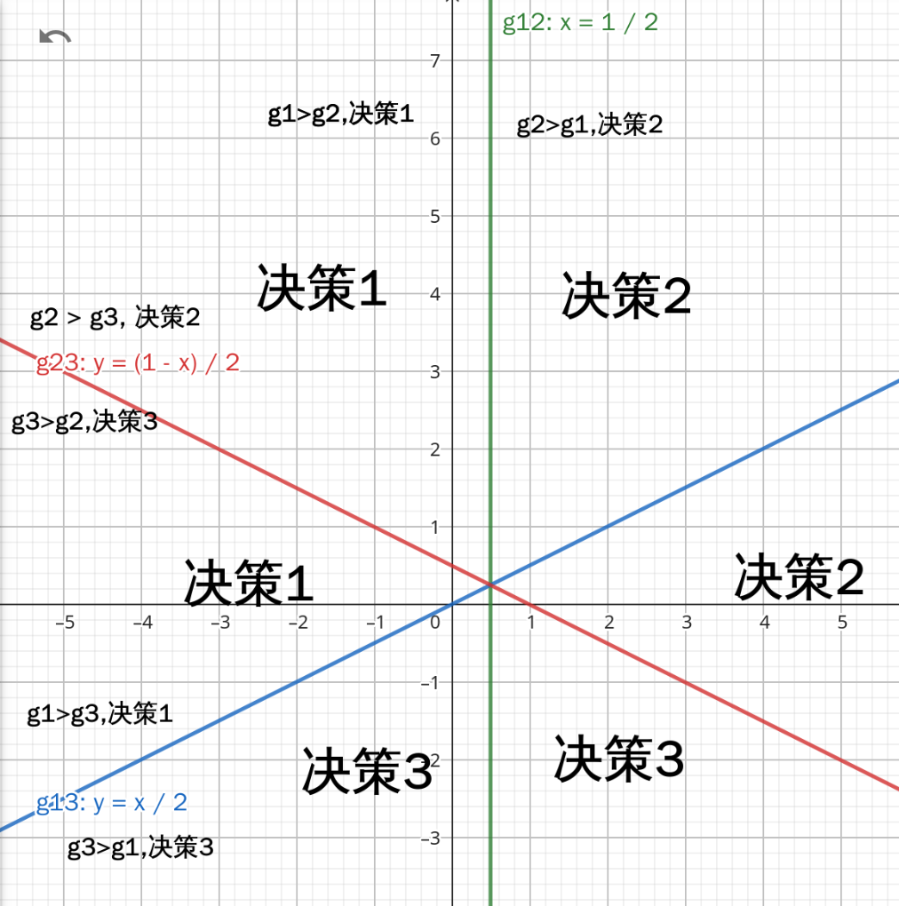

# 作业三

## 第一部分计算与证明

## 题目一

初始权向量为 $a_0 = (0,1,0)^T$

先对样本进行规范化增广样本表示：

- 第一类的两个样本 $(1,4,1)^T,(2,3,1)^T$

- 第二类的两个样本(将y变为-y) $(-4,-1,-1)^T,(-3,-2,-1)^T$

批处理感知准则函数方法求解 $\frac{\partial J_p(a)}{\partial a} = - \sum_{y \in Y} y$

所以更新准则为$a_{k+1} = a_k - \eta_k \frac{\partial J_p(a)}{\partial a} = a_k + \eta_k \sum_{y \in Y} y$

第一次迭代

- $(0,1,0) (1,4,1)^T = 4$，未错分
- $(0,1,0) (2,3,1)^T = 3$，未错分
- $(0,1,0) (-4,-1,-1)^T = -1$，错分
- $(0,1,0) (-3,-2,-1)^T = -2$，错分

$a_1 = a_0 + (-4,-1,-1)^T + (-3,-2,-1)^T = (-7,-2,-2)^T$

第二次迭代

- $(-7,-2,-2) (1,4,1)^T = -17$，错分
- $(-7,-2,-2) (2,3,1)^T = -22$，错分
- $(-7,-2,-2) (-4,-1,-1)^T = 32$，未错分
- $(-7,-2,-2) (-3,-2,-1)^T = 27$，未错分

$a_2 = a_1 + (1,4,1)^T + (2,3,1)^T = (-4,5,0)^T$

第三次迭代

- $(-4,5,0) (1,4,1)^T = 16$，未错分
- $(-4,5,0) (2,3,1)^T = 7$，未错分
- $(-4,5,0) (-4,-1,-1)^T = 11$，未错分
- $(-4,5,0) (-3,-2,-1)^T = 2$，未错分


所有样本均正确分类，此时 $a = (-4,5,0)^T$

## 题目二

$g_1(x) = -x_1 + x_2$

$g_2(x) = x_1 + x_2 - 1$

$g_3(x) = -x_2$

先找到决策边界

$g_1(x) = g_2(x) \Rightarrow x_1 = \frac{1}{2}$

$g_1(x) = g_3(x) \Rightarrow -x_1 + 2x_2 = 0$

$g_2(x) = g_3(x) \Rightarrow x_1 + 2x_2 = 1$

画出决策面



此时不存在分类不确定性区域。

由于这些决策边界是线性的且彼此不重叠，导致在整个特征空间中不存在分类不确定性区域。每个区域都能明确地归类为某个特定的类别，因此分类是确定的。

## 计算机编程题目

1. 编写程序完成 batch perception 算法。
代码为1.cc,数据分别为1.in和2.in

(a) ：

```
➜  work git:(master) ./1 <1.in
迭代了 23 次
a = (-30.400000,34.100000,34.000000)
```

(b)：

```
➜  work git:(master) ✗ ./1 <2.in 
迭代了 16 次
a = (-41.400000,48.600000,19.000000)
```

2. 实现Ho-Kashyap algorithm

代码1.py
对于数据一和三

```
➜  work git:(master) ✗ python3 1.py
No solution found!
分类结果: [[ 0.52222923]
 [ 3.38834308]
 [-0.44801725]
 [ 1.36427013]
 [ 2.77598627]
 [ 1.45570669]
 [ 0.59681974]
 [ 1.04217747]
 [ 2.35541161]
 [ 2.29280706]
 [ 0.45101374]
 [ 1.39461355]
 [-2.15463998]
 [ 0.79707832]
 [ 2.60742166]
 [ 1.18776851]
 [ 3.34911696]
 [ 3.02200334]
 [ 3.18900243]
 [-0.60370431]

有三个数据无法分出
```

对于数据二和四

```
➜  work git:(master) ✗ python3 1.py
分类结果: [[17.09029092]
 [ 0.99999002]
 [10.72202397]
 [13.94856583]
 [12.14310679]
 [ 4.7633886 ]
 [ 5.02902135]
 [ 3.22934322]
 [17.92381664]
 [ 8.33748952]
 [ 3.30007559]
 [ 2.34837548]
 [ 4.84279234]
 [ 5.02668847]
 [ 3.96993838]
 [ 2.5399945 ]
 [ 5.02649878]
 [ 8.1175235 ]
 [ 9.5187525 ]
 [ 7.33488784]
```

全部可以分类出结果


3.

直接运行2.py
使用测试数据分类成功
```
➜  work git:(master) ✗ python3 2.py
[0 0 1 1 2 2 3 3]
```


