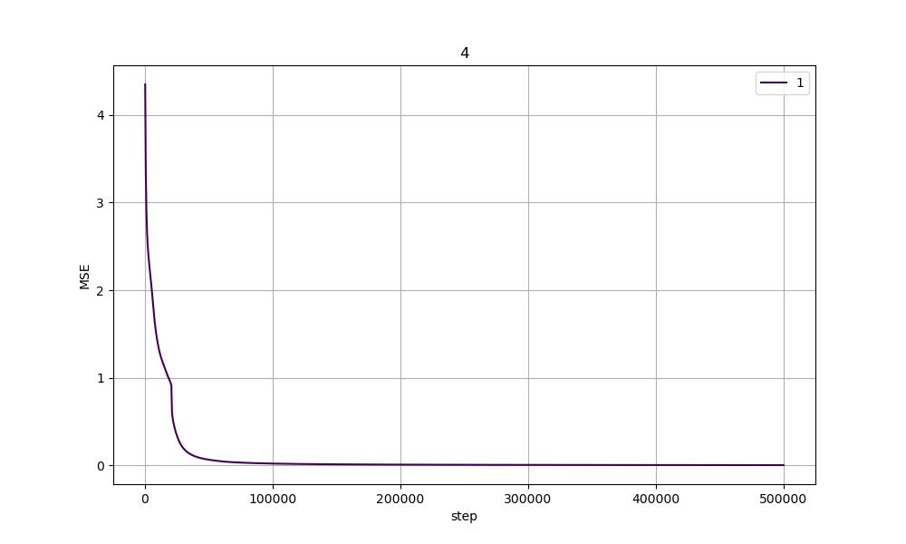

# 作业四

## 题目一

其中三层的网络，隐含层使用 Sigmoid 激活函数 ($f(s) = \frac{1}{1 + e^{-s}}$)。
输出层使用softmax函数作为激活函数$z_j = \frac{e^{net_j}}{\sum_m e^{net_m}}$。

那么下面推导，在平方误差准则$J(w) = \frac{1}{2} \sum_{1\le j\le c}(t_j - z_j)^2$，单个样本对权重更新的影响。

对于从隐含层到输出层的权重 $w_{hj}$：使用梯度下降法

$\frac{\partial J(w)}{\partial w_{hj}} = \frac{\partial J(w)}{\partial net_j} \frac{\partial net_j}{\partial w_{hj}} = \frac{\partial J(w)}{\partial z_j} \frac{\partial z_j}{\partial net_j} \frac{\partial net_j}{\partial w_{hj}} = -(t_j - z_j) \frac{\partial z_j}{\partial net_j} y_h$

使用商求导法则，其中 $\frac{\partial z_j}{\partial net_j} = \frac{(\sum_m e^{net_m}) e^{net_j} - e^{net_j} e^{net_j}}{(\sum_m e^{net_m})^2} = z_j (1 - z_j)$

所以更新法则为 $\Delta w_{hj} = - \eta \frac{\partial J(w)}{\partial w_{hj}} = \eta (t_j - z_j) z_j (1 - z_j) y_h$

对于输入层到隐含层的权重 $w_{ih}$：

$$
\frac{\partial J(w)}{\partial w_{ih}}
= \frac{\partial J(w)}{\partial net_h} \frac{\partial net_h}{\partial w_{ih}}  \\
= \frac{\partial J(w)}{\partial y_h} \frac{\partial y_h}{\partial net_h} x_i  \\
= x_i (\sum_j \frac{\partial J(w)}{\partial net_j} \frac{\partial net_j}{\partial y_h}) \frac{\partial y_h}{\partial net_h}  \\
= x_i (\sum_j -(t_j - z_j) z_j(1 - z_j) w_{hj}) \frac{\partial y_h}{\partial net_h}
$$

其中 $\frac{\partial y_h}{\partial net_h} = \frac{1}{(1 + e^{-net_h})(1 + e^{net_h})}$

所以 $\Delta w_{ih} = \eta x_i \frac{1}{(1 + e^{-net_h})(1 + e^{net_h})} (\sum_j -(t_j - z_j) z_j(1 - z_j) w_{hj})$


所以两个更新公式为：

$\Delta w_{hj} = \eta \delta_j y_h = \eta (t_j - z_j) z_j (1 - z_j) y_h$

$\Delta w_{ih} = \eta \delta_h x_i = \eta x_i \frac{1}{(1 + e^{-net_h})(1 + e^{net_h})} (\sum_j -(t_j - z_j) z_j(1 - z_j) w_{hj})$


## 题目二

反向传播算法，使用损失函数计算输出与真实标签之间的差异，通过梯度下降，进行迭代每个权重。通过链式法则，将损失对输出的导数反向传播,逐层计算每个参数的梯度。先迭代隐含层到输出层的权重。然后再更新输入层到隐含层的权重。

权重更新公式: $w_{hj} \leftarrow w_{hj} + \eta \delta_j y_h$

其中$\delta_j= f^{'}(net_j) \Delta_j = f^{'}(net_j) (t_j - z_j)$ 。公式中 $y_h$ 代表权重所联边的起始结点的输出。$\delta_j$ 代表权重所连边的指向结点收集到的误差信号。

权重更新公式: $w_{ih} \leftarrow w_{ih} + \eta \delta_h y_i$

公式中：$\delta_h = f^{'}(net_h) \sum_j w_{hj} \delta_j$。这里所联边指向结点收集到的误差信号，需要从后一层进行收集误差($\sum_j w_{hj} \delta_j$)。


影响网络性能的因素：

- 学习率：学习率过大可能导致训练不稳定，过小则可能导致收敛速度慢。
- 激活函数：不同的激活函数会影响梯度传播和训练效率。
- 正则化：正则化可以防止过拟合,提高模型的泛化能力。
- 初始权重
- 准则函数
- 隐含层数和结点个数

## 编程题

1. 其中代码 `1.cc` 编写了批量方式更新权重，`2.cc` 编写了采用单样本方式更新权重。

2. (a) 隐含层结点数目较少，则训练精度差。

隐含层结点数目多，训练精度好。

(b) 当更新步长较大，则平方误差下降较快，但是波动会较大。

```
\\ 步长设置为0.1
➜  work4 git:(master) ✗ ./1 <1.in     
迭代次数:1000, 当前平方误差：0.574285 
迭代次数:2000, 当前平方误差：0.108573 
迭代次数:3000, 当前平方误差：0.0481981
迭代次数:4000, 当前平方误差：0.0301201
迭代次数:5000, 当前平方误差：0.021672 
迭代次数:6000, 当前平方误差：0.0168265
迭代次数:7000, 当前平方误差：0.0137012
迭代次数:8000, 当前平方误差：0.0115259
迭代次数:9000, 当前平方误差：0.00992852
迭代次数:10000, 当前平方误差：0.0087080
```

更新步长较小，则平方误差下降较慢。

```
\\ 步长设置为0.01
➜  work4 git:(master) ✗ ./1 <1.in
迭代次数:1000, 当前平方误差：3.64352
迭代次数:2000, 当前平方误差：2.81392
迭代次数:3000, 当前平方误差：2.34133
迭代次数:4000, 当前平方误差：2.00778
迭代次数:5000, 当前平方误差：1.75275
迭代次数:6000, 当前平方误差：1.52434
迭代次数:7000, 当前平方误差：1.1112
迭代次数:8000, 当前平方误差：0.856204
迭代次数:9000, 当前平方误差：0.686859
迭代次数:10000, 当前平方误差：0.56172
```

(c) 网络结构固定情况下，目标函数随着迭代步数增加的变换曲线


