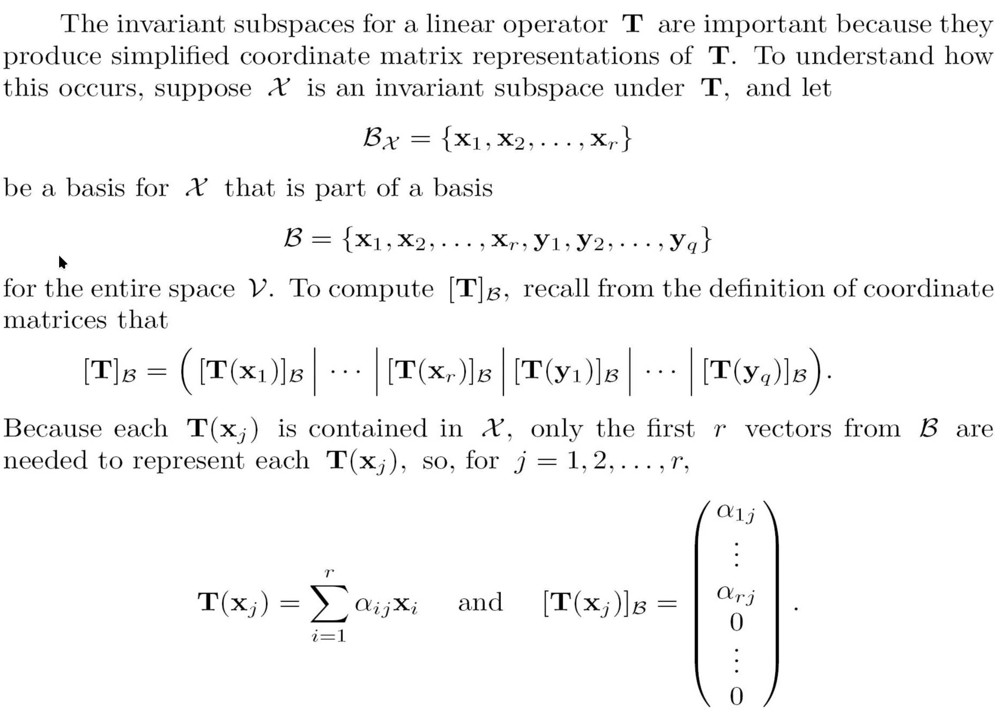
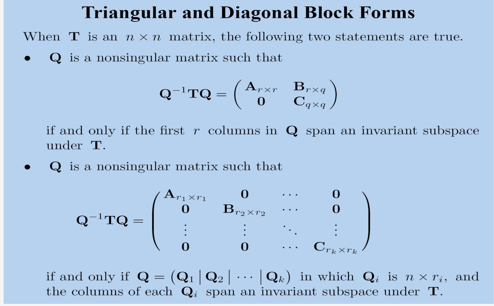

# 线性变换

!!! note "线性变换"

    $U$ 和 $V$ 是在 $F$ 上的两个线性空间。

    一个线性变化 linear transformation from u to v is defined to be a linear function T。

    $T(x+y) = T(x) + T(y)$ and $T(ax) = aT(x)$

线性变换是否可以被一个矩阵代表？

线性变换在有限维空间中，总是可以有一个矩阵表示。

!!! note "空间线性变换"

    对于每一对向量空间$U$和$V$，集合 $L(U,V)$ 是一个线性变化从 U到V。

    记这两个向量空间的基分别为 $B=\{\mu_1,\mu_2,....,\mu_n\}$ 和 $B^{'}= \{ v_1,v_2,...,v_m \}$，

    并且定义线性变换从u到v： $B_{ji}(\mu)=\xi_jv_i$，其中 $[\mu]_B = (\xi_1,\xi_2,...,\xi_n)^T$ 是坐标。

    那么 $B_L = {B_{ji}}^{i=1...m}_{j=1..n}$ 是 $L(U,V)$ 的一个基。

    $dimL(U,V) = (dimU)(dimV)$

    先证明线性无关：

    先记$\sum \eta_{ji} B_{ji}=0$，那么对于 $\mu_k \in B$来说，

    $B_{ki}(\mu_k) = v_i$ 并且 $B_{ji}(\mu_k) = 0(j \ne k)$

    那么 $\sum \eta_{ji} B_{ji}(\mu_k)= \sum \eta_{ki} v_i = 0$

    由于 $v_i$ 是一个基，所以 $\eta_{ki} = 0$ ，同理，就可以得出 $\eta_{ji}= 0$，即证明线性无关。

    再证明$B_{ji}$ 可以span 成集合L(U,V)。
    
    那么记任意$T \in L$，即$T(\mu_j) = \sum_i a_{ji} v_i$，并且记 $\mu = \sum_j \xi_j \mu_j$

    那么$T(\mu) = \sum_j \xi_j T(\mu_j) = \sum_j \xi_j \sum_i a_{ji} v_i = \sum_{i,j} xi_j a_{ji} v_i= \sum_{i,j} a_{ji} B_{ji}(\mu)$

    这样就证明了 $B_{ji}$ 可以span 集合L。

那么 $[T]_{BB^{'}}=([T(\mu_1)]_{B^{'}},[T(\mu_2)]_{B^{'}},...,[T(\mu_n)]_{B^{'}})$

并且这里的矩阵元素其实就是上面推导过程中的a。

矩阵乘法的行为，对于一个线性变换

$[T(\mu)]_{B^{'}} = [T]_{BB^{'}} * [\mu]_{B}$。（其实就是一个坐标变换，从基为B变换为基为 $B^{'}$）

!!! note "change of basis operator"

    我们定义change of basis operator 是 $T(y_i) = x_i$。就是将记为y换为基为x。基换了，但是坐标没换。

    那么就有：$P=[T]_B = [T]_{B^{'}} = [I]_{BB^{'}} = ([x_1]_{B^{'}},[x_2]_{B^{'}},...,[x_n]_{B^{'}})$

    有如下性质 $[v]_{B^{'}} = P * [v]_B$，P是一个非奇异矩阵。

    证明如下

    

紧接着，定义了一个 "Changing Matrix Coordinates"

$[A]_{\mathcal{B}} = P^{-1} [A]_{\mathcal{B^{'}}} P$ 并且 $P = [I]_{\mathcal{B} \mathcal{B^{'}}}$

并且对立的

$[A]_{\mathcal{B^{'}}} = Q^{-1} [A]_{\mathcal{B}} Q$ 并且 $Q = [I]_{\mathcal{B^{'}} \mathcal{B}} = P^{-1}$

??? note "证明"

    记 $\mathcal{B} = \{x_1,x_2,...,x_n\},\mathcal{B^{'}} = \{ y_1,y_2,...,y_m\}$，记A这个线性变换为T。

    先将P乘到左边，那么就转化为了证明 $P [A]_{\mathcal{B}} = [A]_{\mathcal{B^{'}}} P$

    那么要证明等式左右两边相等，则可以转化为等式两遍每一列相等

    其中 $[A]_{\mathcal{B}} = \{ [T(x_1)]_\mathcal{B},[T(x_2)]_\mathcal{B},...,[T(x_n)]_\mathcal{B}$ 是 $n \times n$

    其中 $[A]_{\mathcal{B^{'}}} = \{ [T(y_1)]_\mathcal{B^{'}},[T(y_2)]_\mathcal{B^{'}},...,[T(y_m)]_\mathcal{B^{'}}$ 是 $m \times m$

    并且 $P = \{ [(x_1)]_\mathcal{B^{'}},[(x_2)]_\mathcal{B^{'}},...,[(x_n)]_\mathcal{B^{'}}\}$ 是 $m \times n$。

    那么对于其中任意一列来说，这里看一般的第$i$ 列： $P * \{ [T(x_i)]_\mathcal{B} \} = [A]_{\mathcal{B^{'}}} *\{ [(x_1)]_\mathcal{B^{'}} \}$

    那么左边式子向量 $\{ [T(x_i)]_\mathcal{B} \}$ 经过 P 的变换，其实就是 $\{ [T(x_i)]_\mathcal{B^{'}} \}$

    右边式子向量 $\{ [(x_1)]_\mathcal{B^{'}} \}$ 经过 A 变换，加上了A的作用即为 $\{ [T(x_i)]_\mathcal{B^{'}} \}$

    故两个向量一致，证明完成。

    **这里还有一个点，由于P是可逆的，所以上面的是m=n**

    自己的理解就是左边是先进行线性变换T，然后再进行基的变换。右边是先进行基的变换，然后进行线性变换T。

!!! note "相似"

    Similarity

    矩阵 $B_{n\times n}$ 和矩阵 $C_{n\times n}$ 是相似的，当存在一个可逆矩阵 $B= Q^{-1}CQ$。

    $f(C) = Q^{-1}CQ$ 这个从 $\mathcal{R}^{n \times n} \to \mathcal{R}^{n \times n}$ 的线性变换，称为相似变换。

任何两个关于一个线性变换的坐标矩阵是相似的。

**相似矩阵代表了相同的坐标变换**。

所以任何坐标无关的性质，都是在相似变换下无关(invariant)的性质。

!!! note "Invariant Subspace"

    不变子空间

    有一个线性空间$\mathcal{V}$，一个线性变换 $T$，还有一个向量空间 $\mathcal{X} \subseteq \mathcal{V}$

    就有 $T(\mathcal{X}) = \{ T(x) | x \in \mathcal{X} \}$

    这里 T(V) = R(T)。当 $\mathcal{X}$ 是 $\mathcal{V}$ 的子空间时， $T(\mathcal{X})$ 也是 $\mathcal{V}$ 的子空间。

    通常 $T(\mathcal{X})$ 与 $\mathcal{X}$ 是没有关系的，但是有特殊情况， $T(\mathcal{X}) \subseteq \mathcal{X}$

    这种情况下，就说 $\mathcal{X}$ 是 $T$ 下的不变子空间。可以记为 $T_{/\mathcal{X}}$

??? note "不变子空间效果"
    
    
    

**朴素上理解，就是T作用在这个子空间中的基时，作用的结果只需要使用该基的元素就能表示。** 直观上看，就是下面都是0。那么如果我们能找到更多的不变子空间，那么就能构建一个更简单的矩阵形式。

那么就有矩阵对角化 

**然后就是找到所有的一维度的不变子空间。**

其实就是找特征向量即 $Ax= \lambda x$，这里解出特征值和特征向量，取$\mathcal{B}$ 是由特征向量组成的，这样就可以将一个矩阵相似对角化，$Q = I_{\mathcal{B} E}$。

进行这个操作的目的是为了找到一个在某个基下格式更简单的线性变换。

[ppt](课件6.pdf).
