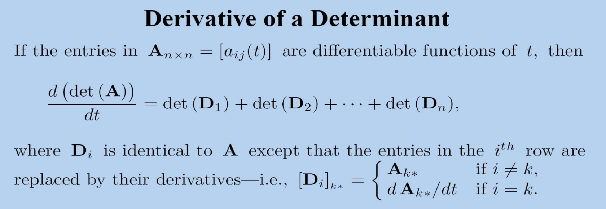

# 矩阵行列式

行列式就是将矩阵变为数。

行列式的朴素定义

$det(A) = \sum_p \sigma(p) a_{1p_1} a_{2p_2} ... a_{np_n}$

$$
\sigma(p) =
\begin{cases}
+1 , 如果p能被偶数次交换排序成自然序 \\
-1 , 如果p能被奇数次交换排序成自然序
\end{cases}
$$

**非方阵是没有定义的**

!!! note "一些性质"

    $det(A^T) = det(A)$

    两行相同，则行列式为0.

    TYPE I: 交换两行，则 $det(B) = -det(A)$

    TYPE II: 某一行乘一个$\alpha$，则 $det(B) = \alpha det(A)$

    TYPE III: 某一行乘一个$\alpha$加到第j行，则 $det(B) = det(A)$

    都可以直接通过定义来证明。

    rank(A) = size of the largest nonzero minor of A

$det(AB) = det(A)det(B)$

证明：如果A是非奇异矩阵，那么A可以拆分成一系列初等变换乘积，然后根据上面可以证明等式成立。
如果A是奇异矩阵，那么整个式子是0，同样成立。

$$
det
\begin{pmatrix}
A & B \\
0 & D \\
\end{pmatrix}
=
det(A) det(D)
$$

!!! note "证明"

    由定义，可以说明

    $$
    det
    \begin{pmatrix}
    A & O \\
    0 & I \\
    \end{pmatrix}
    =
    det(A)
    $$

    那么 

    $$
    \begin{pmatrix}
    A & O \\
    0 & D \\
    \end{pmatrix}
    =
    \begin{pmatrix}
    A & O \\
    0 & I \\
    \end{pmatrix}
    \begin{pmatrix}
    I & O \\
    0 & D \\
    \end{pmatrix}
    $$

    则说明

    $$
    det
    \begin{pmatrix}
    A & O \\
    0 & D \\
    \end{pmatrix}
    =
    det(A) det(D)
    $$

    这里对A和D进行QR分解，那么

 
    $$
    \begin{pmatrix}
    A & B \\
    0 & D \\
    \end{pmatrix}
    =
    \begin{pmatrix}
    Q_1 R_1 & B \\
    0 & Q_2 R_2 \\
    \end{pmatrix}
    =
    \begin{pmatrix}
    Q_1 & 0 \\
    0 & Q_2 \\
    \end{pmatrix}
    \begin{pmatrix}
    R_1 & Q_1^T B \\
    0 & R_2 \\
    \end{pmatrix}
    $$

    其中后面两个矩阵都是可以进行计算的，所以就证明了。

    这是一种利用分解的构造性证明。
   
正交阵的行列式，记A为一个正交阵，则

$AA^T=E \Rightarrow det(A) det(A^T) = 1 \Rightarrow det(A)^2 = 1 \Rightarrow det(A) = \pm 1$

Schur complements

!!! note "Rank-One Updates"

    $det(I + cd^T) = 1 + d^T c$

    证明

    $$
    \begin{pmatrix}
    I & 0 \\
    d^T & 1 \\
    \end{pmatrix}
    \begin{pmatrix}
    I + cd^T & c \\
    0 & 1 \\
    \end{pmatrix}
    \begin{pmatrix}
    I & 0 \\
    -d^T & 1 \\
    \end{pmatrix}
    =
    \begin{pmatrix}
    I & c \\
    0 & 1 + d^Tc \\
    \end{pmatrix}
    $$

    同样的

    $det(A + cd^T) = det(A) (1 + d^T A^{-1} c)$

Cramer's Rule

解释了一个非奇异方程组的第i个解为

$x_i = \frac{det(A_i)}{det(A)}$

!!! note "证明"

    首先可以直接写出

    $A_i = A + (b - A_{*i})e_i^T$

    然后使用上面的公式

    $$
    det(A_i) = det(A) det(1 + e_i^T A^{-1}(b - A_{*i})) =
    det(A) det(1 + e_i^T(x - e_i))
    = det(A) x_i
    $$

Cofactors

定义主子式

$A_{ij} = (-1)^{i+j} M_{ij}$

就可以使用 Cofactor Expansions

[矩阵行列式](课件9.pdf)
